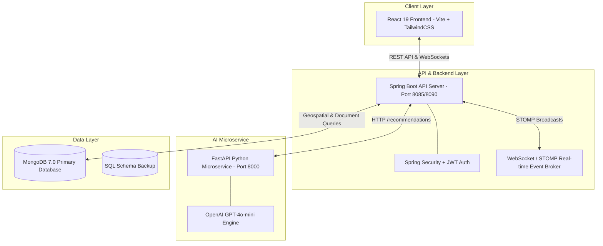
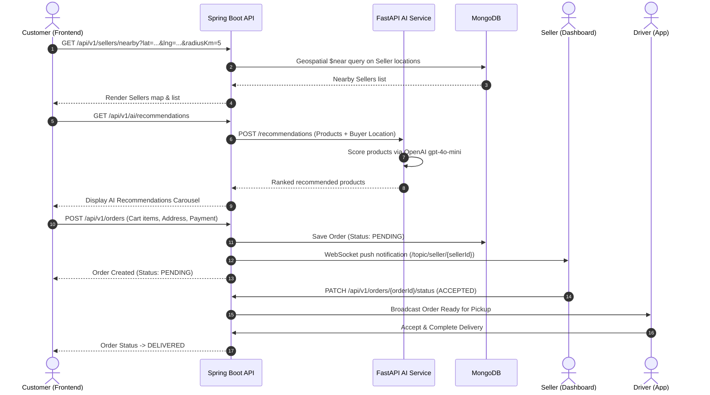

<div align="center">

# 🛒 HyperKart
### *AI-Powered Hyperlocal E-Commerce Platform*

[](https://react.dev/)
[](https://spring.io/projects/spring-boot)
[](https://fastapi.tiangolo.com/)
[](https://www.mongodb.com/)
[](https://openai.com/)
[](https://www.docker.com/)

<p align="center">
  <b>HyperKart</b> connects neighborhood buyers with local stores and delivery partners in real time, leveraging <b>geospatial proximity mapping</b>, <b>AI-driven personalizations</b>, and <b>WebSocket live notifications</b>.
</p>

---

[Key Features](#-key-features) •
[Architecture](#-system-architecture) •
[System Workflows](#-system-workflows) •
[Folder Structure](#-directory-structure) •
[Getting Started](#-quick-start-guide) •
[API Reference](#-api-endpoints)

</div>

---

## ✨ Key Features

<details open>
<summary><b>🛍️ 1. Hyperlocal Buyer Experience</b></summary>

* **Geospatial Store Discovery**: Automatic device GPS location detection and interactive Leaflet map rendering within customizable radii (e.g., 5 km).
* **AI Personalization Carousel**: OpenAI GPT-4o-mini powered recommendation engine scoring items by distance, stock level, and buyer preference.
* **Smart Rewards & Discounts**: Scratch-card rewards, student verification coupons, and group buying deals.
* **Real-time Order Tracking**: Live WebSocket status updates (*Pending* ➔ *Accepted* ➔ *Picked Up* ➔ *Out for Delivery* ➔ *Delivered*).
</details>

<details open>
<summary><b>🏪 2. Seller Command Center</b></summary>

* **Live Order Notifications**: Instant sound and visual alerts when new orders arrive via STOMP WebSocket channels.
* **Interactive Store Pinning**: Integrated map location picker for precise storefront coordinates.
* **Inventory & Flash Deals**: Dynamic stock controls, price adjustments, and temporary flash sale broadcasts.
</details>

<details open>
<summary><b>🚚 3. Driver Delivery Dashboard</b></summary>

* **Neighborhood Pickup Pool**: Nearby ready-for-pickup orders broadcasted to active drivers.
* **Turn-by-Turn Navigation**: Built-in Google Maps navigation routing between store and buyer location.
* **Instant Wallet Payouts**: Automatic earnings calculation and payout logging upon successful delivery completion.
</details>

<details open>
<summary><b>🛡️ 4. Admin Governance & Safety</b></summary>

* **Platform Analytics**: Real-time Gross Merchandise Value (GMV), total active users, sellers, and drivers overview.
* **Verification Onboarding**: Document review and approval controls for incoming sellers and delivery partners.
* **Emergency SOS Dispatch**: One-click safety modal triggering real-time alerts for driver and seller field support.
</details>

---

## 🏗️ System Architecture



---

## 🔄 System Workflows



---

## 📁 Directory Structure

```
HyperKart/
├── 📄 README.md                        # Master Interactive Documentation
├── 📄 docker-compose.yml               # Multi-container Orchestration (Mongo, Backend, AI, Frontend)
├── 📄 index.html                       # Entry Point / Environment Auto-redirector
├── 📄 deploy-frontend.ps1              # Automated PowerShell Production Build & Deploy Script
├── 📄 hyperkart_database.sql           # Primary SQL Dataset & Schema Reference
│
├── 📂 frontend/                        # React 19 + Vite + TailwindCSS App
│   ├── 📂 src/
│   │   ├── 📂 components/              # Reusable UI (Layout, Maps, Widgets, Modals)
│   │   ├── 📂 pages/                   # Views (Home, Cart, Admin, Seller, Driver, Orders)
│   │   ├── 📂 lib/                     # API Clients, WebSockets, Utilities
│   │   └── 📂 store/                   # Redux Toolkit Global State
│   ├── 📄 vite.config.js               # Vite Bundler Configuration
│   └── 📄 package.json                 # Frontend Dependencies
│
├── 📂 backend/                         # Spring Boot 3 Backend Service (Java 17)
│   └── 📂 demo/
│       ├── 📂 src/main/java/com/example/demo/
│       │   ├── 📂 auth/                # Security, JWT & Data Initializers
│       │   ├── 📂 common/              # Global Handlers, Health & Public APIs
│       │   ├── 📂 geo/                 # Geospatial Distance Computations
│       │   ├── 📂 order/               # Order Lifecycle & STOMP WebSockets
│       │   ├── 📂 product/             # Catalog & Stock Management
│       │   └── 📂 seller/              # Seller Store Profiles
│       └── 📄 pom.xml                  # Maven Dependencies
│
├── 📂 ai-service/                      # FastAPI Python AI Microservice
│   ├── 📄 main.py                      # FastAPI OpenAI GPT-4o-mini Recommendation Engine
│   └── 📄 requirements.txt             # Python Dependencies
│
└── 📂 docs/                            # Deep Architectural Specs & Workflow Guides
    └── 📄 HyperKart_System_Workflows.md # Complete Sequence & Flowcharts
```

---

## ⚡ Quick Start Guide

### Prerequisites
- [Docker & Docker Compose](https://www.docker.com/) installed
*OR*
- Java 17+, Node.js 18+, Python 3.11+, and MongoDB 7.0 installed locally.

---

### Option A: Running with Docker Compose (Recommended)

1. **Clone the repository**:
   ```bash
   git clone https://github.com/praveensehrawat/HyperKart.git
   cd HyperKart
   ```

2. **Copy the environment file**:
   ```bash
   cp .env.example .env
   ```

3. **Launch all containers**:
   ```bash
   docker-compose up --build
   ```

4. **Access Applications**:
   * 🌐 **Frontend Application**: `http://localhost:3000`
   * ⚙️ **Backend REST API**: `http://localhost:8085`
   * 🤖 **AI Microservice**: `http://localhost:8000`

---

### Option B: Local Microservice Development

#### 1. Backend (Spring Boot)
```bash
cd backend/demo
.\mvnw.cmd spring-boot:run
```

#### 2. Frontend (React + Vite)
```bash
cd frontend
npm install
npm run dev
```

#### 3. AI Service (FastAPI)
```bash
cd ai-service
pip install -r requirements.txt
uvicorn main:app --reload --port 8000
```

---

## 🔌 API Endpoints Summary

| Method | Endpoint | Description | Auth Required |
| :--- | :--- | :--- | :--- |
| `POST` | `/api/auth/login` | User login & JWT issuance | ❌ No |
| `POST` | `/api/auth/register` | Register new Customer / Seller / Driver | ❌ No |
| `GET` | `/api/sellers/nearby` | Fetch sellers by GPS radius | ❌ No |
| `GET` | `/api/products` | Browse product catalog | ❌ No |
| `POST` | `/api/orders` | Place new hyperlocal order | 🔒 Yes |
| `PATCH` | `/api/orders/{id}/status` | Update order state (Accept/Pickup/Deliver) | 🔒 Yes |
| `GET` | `/api/ai/recommendations` | Fetch AI personalized product scores | 🔒 Optional |

---

<div align="center">

Developed with ❤️ by **[Praveen Sehrawat](https://github.com/praveensehrawat)**

⭐ *If you find HyperKart useful, please consider giving it a star on GitHub!* ⭐

</div>
