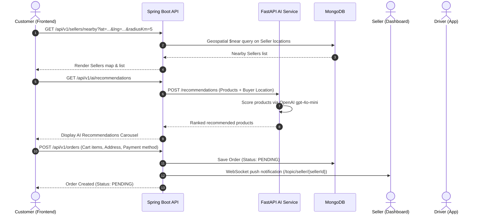
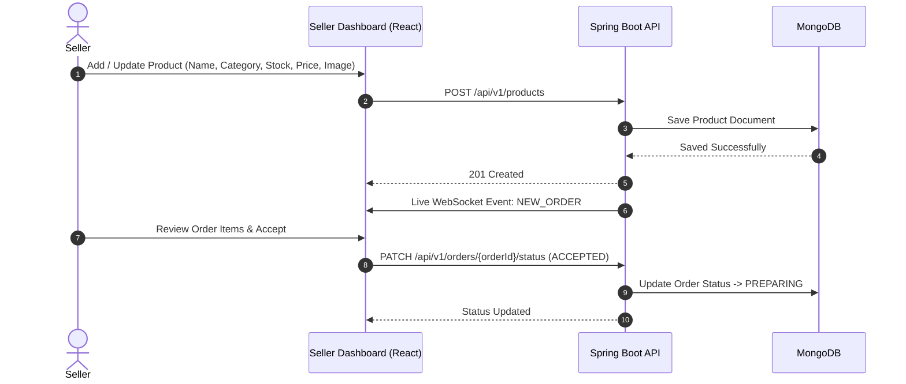
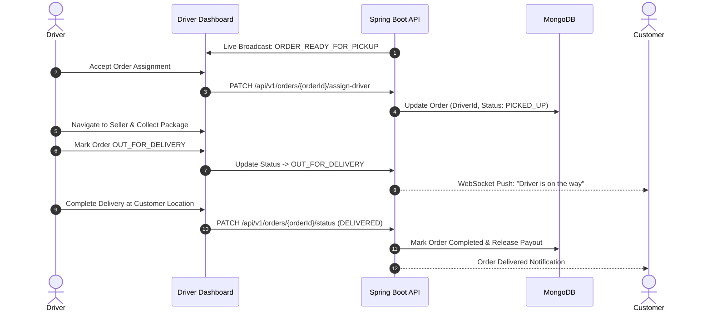
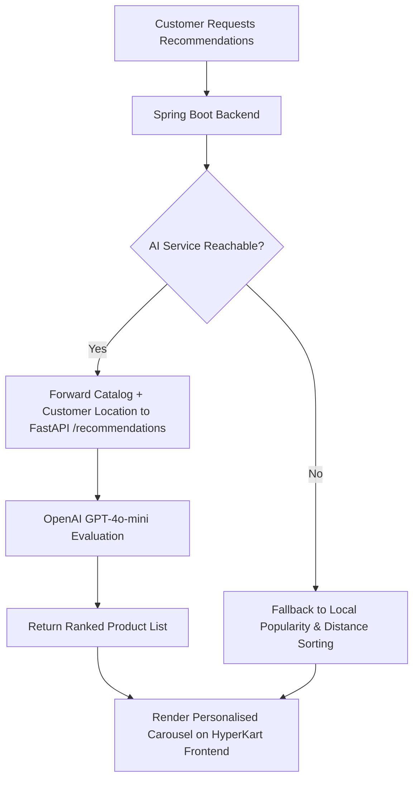

# HyperKart System Workflows & Architecture

This document provides a comprehensive overview of the core operational workflows and technical data flows within the **HyperKart** platform.

---

## 🗺️ 1. Customer Discovery & Hyperlocal Ordering Workflow

### Operational Steps:
1. **Location Detection**: The customer opens the **HyperKart** web app. Geolocation API pins their current coordinates.
2. **Hyperlocal Store Discovery**: The backend queries MongoDB for sellers within a configurable radius (e.g., 5 km).
3. **AI Personalization**: Products are ranked in real-time by the AI service taking into consideration distance, stock, and category relevance.
4. **Checkout & Rewards**: The customer applies student/promo discounts or scratch-card rewards and places the order.
5. **Order Dispatch**: Spring Boot persists the order state and broadcasts a live STOMP WebSocket notification to the designated seller.

---

## 🏪 2. Seller Store & Inventory Management Workflow

### Operational Steps:
1. **Catalog Setup**: Sellers create their store profile, pin their location on the map picker, and add products to their inventory.
2. **Order Notification**: When a customer places an order, the seller receives a visual and audible alert on the Seller Dashboard.
3. **Order Preparation**: The seller marks the order as `ACCEPTED` and `PREPARING`, updating customer status in real-time.

---

## 🚚 3. Driver Delivery & Routing Workflow

### Operational Steps:
1. **Assignment**: Drivers view available ready-for-pickup orders in their neighborhood radius.
2. **Pickup & Route**: The driver accepts the delivery and navigates to the seller using integrated Google Maps routes.
3. **Completion**: Upon reaching the customer, the driver completes the order, triggering automatic payout logging and customer notification.

---

## 🤖 4. AI Service Integration & Scoring Workflow

---

## 🛡️ 5. Admin Governance & Platform Operations Workflow

1. **Verification & Onboarding**: Admins review new Seller store registrations and Driver documentation before granting platform access.
2. **Live Platform Analytics**: Admins monitor active orders, gross merchandise value (GMV), system health, and service uptime.
3. **Emergency / SOS Response**: Integrated emergency dispatch alerts for instant driver/seller safety assistance.
